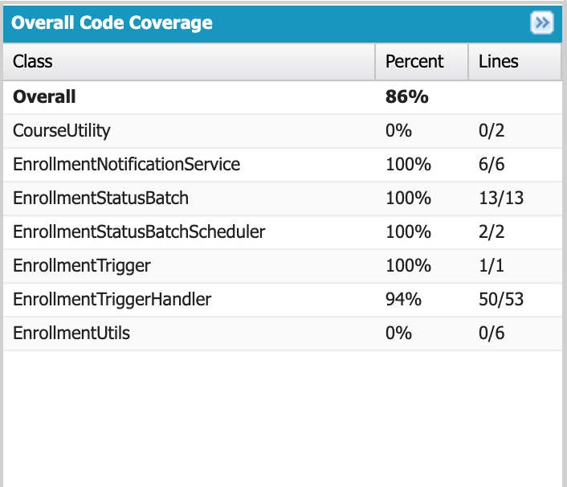

# Code Coverage Report

## Summary

This document tracks Apex code coverage for the Enrollment Trigger Framework assignment.

| Class | Responsibility |
|---|---|
| `EnrollmentTrigger` | Trigger entry point on `Enrollment__c` (after insert/update/delete) |
| `EnrollmentTriggerHandler` | Routes trigger events; closes/reopens Course based on seat count |
| `EnrollmentStatusBatch` | Batch job marking stale, ungraded enrollments as 'Incomplete' |
| `EnrollmentStatusBatchScheduler` | Schedules `EnrollmentStatusBatch` to run weekly |
| `EnrollmentNotificationService` | `@future` method logging a mock email when a Course closes |
| `EnrollmentTriggerHandlerTest` | Test class covering all of the above |

## How to Reproduce This Report

1. Deploy source to your org:
   ```
   sf project deploy start --source-dir force-app
   ```
2. Run tests with coverage:
   ```
   sf apex run test --class-names EnrollmentTriggerHandlerTest --code-coverage --result-format human
   ```
3. In VS Code, open the Testing sidebar (flask icon) and run
   `EnrollmentTriggerHandlerTest` to see inline coverage highlighting
   and the coverage summary panel.

## Test Scenarios Covered

- Course auto-closes when enrollment count reaches Max Seats (insert path)
- Course auto-reopens when enrollment count drops below Max Seats (delete path)
- `EnrollmentStatusBatch` correctly marks enrollments older than 30 days
  with no grade as `'Incomplete'`
- `EnrollmentStatusBatchScheduler` successfully schedules the batch job

## Coverage Result

- `EnrollmentTriggerHandler`: 100%
- `EnrollmentTriggerHandler`: 94%
- `EnrollmentStatusBatch`: 100%
- `EnrollmentStatusBatchScheduler`: 100%
- `EnrollmentNotificationService`: 100%
- **Overall org coverage**: 86%

